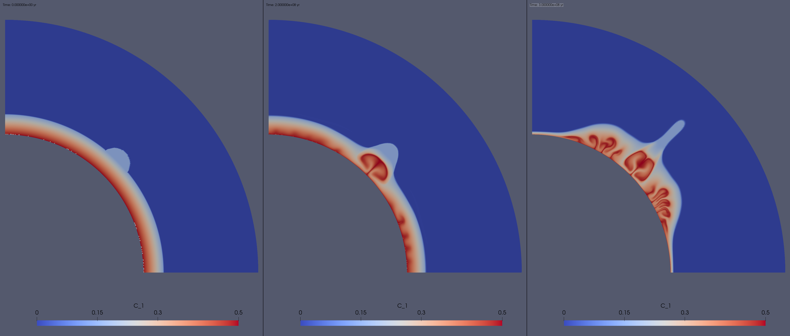
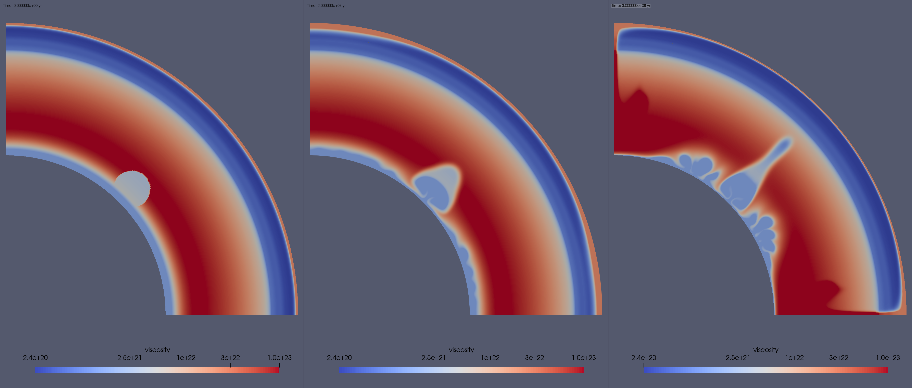

({ref}`sec:cookbooks:multicom_steinberger`)=
#  Thermochemical plume model using multiple P--T look-up tables

*This section was contributed by Qianyi Lu.*

This cookbook is trying to model the evolution of a thermochemical plume similar
to what have been done in {cite:t}`Dannberg:Sobolev:2015`. It is also an example 
of how to use multiple look-up tables in the `Steinberger Material model`. 

:::{seealso}
See {ref}`sec:cookbooks:steinberger` for a more detail discussion of the 
`Steinberger Material model`, the format of the look-up table, and the viscosity 
structure of the model.
:::

## The look-up tables used in this cookbook. 

Our material model uses two look-up tables, one for the pyrolitic ambient mantle, 
and the other for the recycled oceanic crust accumulated at the CMB. The pyrolitic 
look-up table can be found at 
[data/material-model/steinberger/pyr_MS95_with_volume_fractions_lo_res.dat](https://www.github.com/geodynamics/aspect/blob/main/data/material-model/steinberger/pyr_MS95_with_volume_fractions_lo_res.dat).
The basaltic look-up table can be found at [data/material-model/steinberger/morb_G13_with_volume_fractions_lo_res.dat](https://www.github.com/geodynamics/aspect/blob/main/data/material-model/steinberger/morb_G13_with_volume_fractions_lo_res.dat).
These look-up tables are computed using Perple_X, {cite}`connolly:2005`, a mineral 
physics software base on the thermodynamic database of {cite:t}`stixrude:Lithgow:2011`,
a pyrolitic composition {cite}`mcdonough:sun:1995`, and a basaltic composition 
{cite}`gale:etal:2013`.

The resolution of these two look-up tables is very low (every 2 GPa and 100 K) 
so they should only be used for tested but not for any serious research purpose. 
You can generate a higher resolution look-up table using `Perplex`, 
see <http://www.perplex.ethz.ch/>.

## General model setup.

The model setup is a quarter spherical shell with all free slip boundaries. 
Setting the side boundaries to be periodic as in {ref}`sec:cookbooks:steinberger`
would cause the thermochemical anomaly to drift along the bottom boudary layer, 
which is not desired for this model. The boundary temperature, gravity, and 
heating model setup of this model is identical to those in {ref}`sec:cookbooks:steinberger`.
The key differences between this cookbook and {ref}`sec:cookbooks:steinberger` 
appear in the `Initial temperature model`, `Compositional fields`, and 
`Initial composition model`. We are going to go through how to set up 
the input parameters file stey by step.

## Set up the compositional field and initial composition model.

The first thing we need to do is specifying how many compositional fields are 
used in the model. Here, we use one compositional field represent the basaltic 
materials and the background field is defaulted to be pyrolitic materials.

```{literalinclude} comp.field.prm
```

The Material model setup is similar to "steinberger.prm" except we are having 
N+1 material files for N compositional fields. The material files are ordered 
as "background, field#1, field#2, ..." For intermediate composition values, 
material properties will then be averaged based on the mass/volume fractions 
of the individual compositions.

```{literalinclude} lookup.part.prm
```

Our initial composition setup is similar to Supplementary Figure 2b in 
{cite:t}`Dannberg:Sobolev:2015`.  By varying the fraction of the compositional
field, we can prescribe a basal layer with 50% basaltic materials at the CMB and 
gradually decrease to 15% at 500 km above the CMB. The percentage of the basaltic 
materials is determined by a linear function:
```{math}
f(radius) = c + k * radius,
```
where $k = -7e-7 m^{-1}$ is the slope of the line, $c = 2.9367$, and $radius$ 
is the distance from the center to a given point in $m$. You can modify $k$ 
and $c$ to prescribe a different distribution of basaltic materials in the basal 
layer. On top of the basal layer, we prescribe an 400-km-radius circular 
compositional anomaly with 15% of basaltic materials if it is above the basal 
layer. The domain where the anomaly overlaps with basal layer have the same 
composition as the basal layer. All the other domains in the should be 100% 
pyrolitic ({numref}`fig:steinberger-viscosity1`:right). 

```{literalinclude} comp.setup.prm
```
:::{note}
The percentage of basaltic materials of the circular anomaly should equal to 
the percentage of basaltic materials at the top of the basal layer to prevent 
a composition discontinuity between the basal layer and the circular anomaly.
:::

## Set up the initial temperature model to enable a coupled thermochemical basal layer and anomaly.

To be consistent with the model setup in {cite:t}`Dannberg:Sobolev:2015` (see
Supplementary Figure 2a) and the mantle processes, we would like a initial 
temperature field that is coupled with the initial compositon field. That is, 
we want a hot mixture of basaltic and pyrolitic basal layer with a circular 
anomaly, where the circular anomaly has an plume excess temperature. The initial 
temperature field should also be consistent with the adiabatic temperature 
condition in the model.

Our model has a `adiabatic surface temperature` of 1600 K. By using `List of model names` 
instead of `Model names` and specifying `List of model operators = add`, we 
are able to add the function expression and the boundary temperature model 
expression to the adiabatic temperature profile. 

We use the half-space cooling model to set up a 100 Ma top boundary layer and 
a 3.5 Ga bottom boundary layer. We use `Function` to prescribe a circular 
thermal anomaly at the same position with the same size as the compositional 
anomaly. The temperature of theanomaly is the maximum value between 400 K and 
the temperature difference between the actual temperature profile and the ambient 
mantle adiabat. This setup would produce a thermal anomaly with an excess 
temperature of 400 K that deviates from the bottom thermal boundary layer smoothly. 
```{literalinclude} temperature.setup.prm
```
Since we use a set of arbitary heat capacity, density, and thermal conductivity to 
calculate the thermal diffusivity (function constant `kappa`) and the heat capacity 
and density are obtained from the look-up table, you should choose the values that 
are representative for your model. You can do it by first setting `End time = 1` 
and running the model. You then find the representative heat capacity and density 
values for your model from the visualization output, and the thermal conductivity is 
set to be 1.5 K/m in the `material model`. Other than `kappa`, the other constants 
used in the `Function`, the adiabatic bottom temperature (`Tab`)and the age of the 
bottom thermal boundary layer (`age`), should also consistent with the adiabatic 
temperature setup of the model.

You may also notice that there is a `subsection Function` under `subsection Adiabatic`. 
This function has a expression of `0` so it would not affect the initial temperature 
field but it should have the same number of terms as the `Number of fields` set in the 
`Compositional fields`. Please see [ASPECT forum discussion](https://community.geodynamics.org/t/there-is-a-problem-when-use-initial-temperature-model-adiabatic-half-space-cooling-with-number-of-composition-greater-than-1-ascii-model/3160/2) for more information.


The complete input file can be found in
[cookbooks/multicomponent_steinberger/doc/steinberger_thermochemical_plume.prm](https://www.github.com/geodynamics/aspect/blob/main/cookbooks/multicomponent_steinberger/doc/steinberger_thermochemical_plume.prm).

## Results

We run the model for 300 million years. Plumes from the initial thermochemical
anomaly as well as from the thermal boudary layer. However, no plumes has risen 
up to the base of the lithosphere due to the mid-mantle viscosity hump and the
low bouyancy flux of the plume ({numref}`fig:viscosity-multicomp-steinberger`). 
You may need to adjust the reference viscosity profile and/or decrease the percentage 
of basaltic materials within the initial thermochemical anomaly to get similar
results from {cite:t}`Dannberg:Sobolev:2015`.


```{figure-md} fig:temperate-multicomp-steinberger


 Temperature field of the model at 0, 200, and 300 Ma.
```

```{figure-md} fig:compfield-multicomp-steinberger


 Fraction of compositional field "C_1" at 0, 200, and 300 Ma. "C_1" represents the
the basaltic material.
```
```{figure-md} fig:viscosity-multicomp-steinberger


 Viscosity field of the model at 0, 200, and 300 Ma.
```